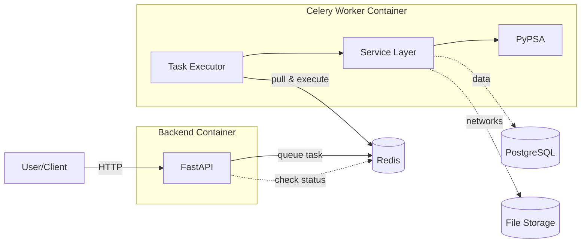

# PyPSA App
Self-hosted web application for analyzing and visualizing PyPSA networks, with modular
architecture designed to extend into workflow execution, network editing, optimization,
and custom integrations.

> [!WARNING]
> This app is in early development. Expect things to not work and break! It is **not** recommended to deploy the app in production!


## Features

- Network Management
- Generate network statistics and plots
- Interactive geospatial visualization via Kepler.gl
- Multiple deployments
  - Deploy with minimal setup for single user local dashboard and simple analysis of a few networks
  - Or use scalable deployment with user management, asynchronous task scheduling, in-memory caching and a Postgres database
- Optional authentication via GitHub OAuth

> [!TIP]
> There is a prototype deployed under [`https://app-dev.pypsa.org/`](https://app-dev.pypsa.org/). If you would like to have access, reach out to [@lkstrp](https://github.com/lkstrp/).

### Roadmap

- [ ] Upload Networks via interface
- [ ] Show and edit network components data
- [ ] User Permissions (own Networks, make them public/ share networks)
- [ ] MVP for execution module
   - This will allow to run any snakemake based PyPSA Models (e.g. `pypsa-eur`, `pypsa-earth`) within the web interface.
- [ ] Better integration current map: Allow to make selection which filters components for visualizations
- [ ] More plotting functionality, create custom views and store them

Upstream changes (within the PyPSA Framework)
- [ ] Improved IO method (Faster, more efficient and with better support for geospatial data)
- [ ] More stable Network collections with matching rules

## Quick Start

Check out the difference between the minimal and full version [below](README##Architecture).

### Minimal version

#### Python Package

> [!NOTE]
> Installation via python package is coming soon.

#### Docker

To deploy a minimal local instance:
- Put your networks in `./data/networks` (or upload them in the web interface)
- Run `docker --user $(id -u):$(id -g) -p 8000:8000 -v $(pwd)/data:/app/data ghcr.io/pypsa/pypsa-app:latest`

Open your browser at [`http://localhost:8000`](http://localhost:8000).

There is also a minimal compose file: `compose/compose.minimal.yaml`

### Full version
The full version separates the FastAPI web server and Celery worker into separate containers
that communicate via Redis (used for task queuing, result storage and caching),
with PostgreSQL storing network and app data and a file storage containing network files.
It is useful to run the app for multiple users but not necessary for single user local use.

Checkout the `compose/compose.full.yaml` example compose file, the [configuration](README##Configuration) options and also have a look on the [Architecture](README##Architecture).

> [!WARNING]
> This app is in early development and it is **not** recommended to deploy the app in production! Also, it is recommended to add further infrastructure, like a reverse proxy, proper logging, monitoring etc.

## Configuration

> [!NOTE]
> Configuration documentation is coming soon.

## Architecture

The app can be used and deployed in different ways. There is a minimal and a full version,
but features can also be added granularly. This flexibility supports different use cases: From a single-user local dashboard for simple analysis
of a few networks to a production ready scalable deployment with user management, asynchronous
task scheduling, Redis caching and a Postgres database.

### Comparison
| Feature          | Minimal                            | Full                  |
|------------------|------------------------------------|-----------------------|
| Distribution     | Python package                     | Docker-only           |
| Deployment       | Single container                   | Multi-container stack |
| Multi-user       | No                                 | Yes                   |
| Task execution   | Background threads in same process | Separate worker processes                  |
| Scalability      | None                               | High                  |
| Database         | SQLite file                        | PostgreSQL            |
| Frontend         | Reduced features                   | All features          |
| Use case         | Local Dashboard <br> for a few networks    | Production with <br> multiple users |


### System Architecture

Click below to find a simplified system architecture diagram.
The minimal version merges backend and worker containers into one, uses SQLite instead
of Postgres, and runs tasks in a single process instead of using Celery and Redis.

<details>

<summary>System Architecture Diagram</summary>



</details>


## Development Setup

### Requirements

- Python ≥ 3.13
- Node.js (for frontend development)
- Docker (optional, for containerized development)

### Backend

```bash
# Install dependencies
uv sync --extra dev --extra full

# Run API server without frontend serving
pypsa-app serve --dev --reload
# or use dev compose file, which does not serve the frontend
docker-compose -f docker-compose.dev.yml up
```

API documentation available at [`http://localhost:8000/docs`](http://localhost:8000/docs).


### Frontend

Main application (SvelteKit):

```bash
cd frontend/app
npm install
npm run dev
```

Map visualization (React + Kepler.gl):

```bash
cd frontend/map
npm install
npm run dev
```

Main application frontend available at [`http://localhost:5173`](http://localhost:5173).

Map visualization available at [`http://localhost:5174`](http://localhost:5174).

## License

The PyPSA App is licensed under the `AGPL-3.0` license.
